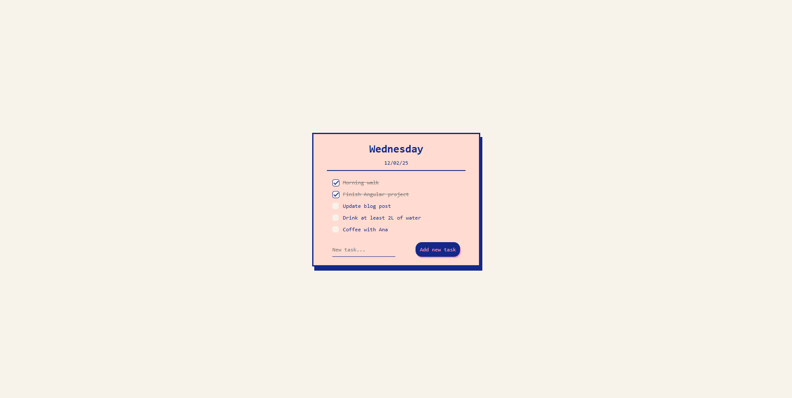

# 📝 To do list

A minimalistic to-do list to add and remove daily tasks.

## 🚀 Demo  

[Live Demo](https://to-do-list-project-angular17.netlify.app/)

## 📸 Screenshots
### 💻 Desktop view

### 📱 Mobile view

## ✨ Features  
- 📝 Add and remove tasks easily  
- 🎨 Minimalist and clean design  
- 🔄 Saves tasks locally

## 🛠 Technologies Used  
- **Angular**, [Angular CLI](https://github.com/angular/angular-cli) version 17.3.11.
- **TypeScript**

## 🏃‍♂️ Development & Build  

- Run `ng serve` to start the dev server at `http://localhost:4200/` (auto-reloads on changes).  
- Use `ng generate <type> <name>` to create components, directives, services, etc.  
- Run `ng build` to generate production-ready files in the `dist/` folder.

## ℹ️ More Info  

For detailed CLI commands, visit the [Angular CLI Documentation](https://angular.io/cli) or run `ng help`.  
